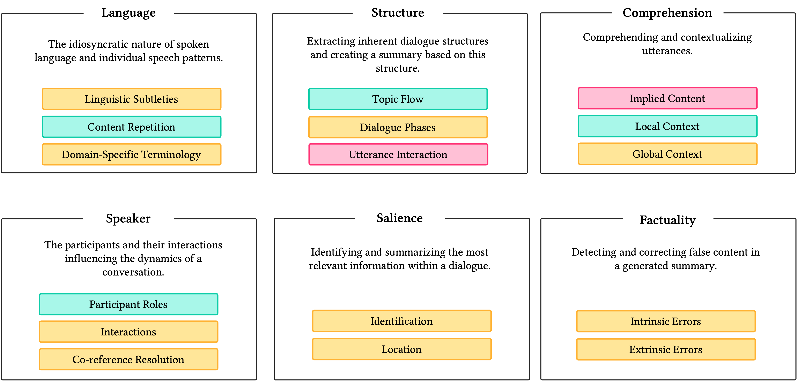

<div align="center">
  <h1>CADS: A Systematic Literature Review on the Challenges of Abstractive Dialogue Summarization</h1>

A collection of papers and resources across the four principal components of dialogue summarization: Challenges, Techniques, Datasets, and Metrics.
The sub-folders contain our code to crawl the [Semantic Scholar](https://www.semanticscholar.org/) and [DBLP](https://dblp.org/) databases.
We intend to periodically update this repository for its ongoing relevance in the current era of LLMs. Stay tuned!
  
  <p>
    <a href="https://jair.org/index.php/jair"></a>
  </p>
</div>


## Table of Contents

- [Overview](#-overview)
- [The CADS Taxonomy](#-the-cads-taxonomy)
- [Methodology](#-methodology)
- [Challenges](#-challenges)
  - [Language Challenge](#language-challenge)
  - [Structure Challenge](#structure-challenge)
  - [Comprehension Challenge](#comprehension-challenge)
  - [Speaker Challenge](#speaker-challenge)
  - [Salience Challenge](#salience-challenge)
  - [Factuality Challenge](#factuality-challenge)
- [Techniques](#-techniques)
- [Datasets](#-datasets)
- [Evaluation Metrics](#-evaluation-metrics)
- [Future Research Directions](#-future-research-directions)
- [Citation](#-citation)

## 📋 Overview

This repository accompanies our systematic literature review on abstractive dialogue summarization, published in the Journal of Artificial Intelligence Research (JAIR) 2025. Our work examines **1,262 papers** published between 2019-2024, with **133 papers** selected for comprehensive analysis based on strict inclusion criteria.

We introduce the **CADS Taxonomy** (Challenges of Abstractive Dialogue Summarization), a novel framework that categorizes the major challenges in dialogue summarization and maps them to corresponding techniques, datasets, and evaluation metrics. This taxonomy provides a unified understanding of the field's inherent complexity and highlights areas where significant progress has been made or where more research is needed.

## 🧠 The CADS Taxonomy

<div align="center">
  
  <p><i>Figure 1: Overview of the six challenges in dialogue summarization, including a brief description of each challenge and an estimation of progress for related sub-challenges. Green means mostly mitigated, orange means good progress, and red stands for marked challenges still exist.</i></p>
</div>

Our analysis revealed six major challenges in dialogue summarization:

1. **Language**: Handling the idiosyncratic nature of spoken language, including informal expressions, ungrammatical structures, colloquialisms, and domain-specific terminology.

2. **Structure**: Extracting and representing the underlying organization of a conversation, including topic flow, dialogue phases, and utterance dependencies.

3. **Comprehension**: Understanding both explicit and implicit content in dialogues, requiring local and global context awareness and background knowledge integration.

4. **Speaker**: Tracking participant roles, their interactions, and references to entities and other participants, including role changes across topics.

5. **Salience**: Identifying content critical for insightful summaries, locating relevant text spans, and adapting to different viewpoints and audiences.

6. **Factuality**: Ensuring generated summaries accurately reflect the conversation, avoiding both extrinsic errors (hallucinations) and intrinsic errors (misrepresentations).

## 🔬 Methodology

Our systematic literature review followed the [PRISMA](https://www.prisma-statement.org/) (Preferred Reporting Items for Systematic Reviews and Meta-Analyses) methodology to ensure transparency, reproducibility, and comprehensiveness. The review process comprised two sequential stages with rigorously defined parameters.

### Stage 1: Retrieving Candidate Documents

We conducted a systematic search of academic literature using two established scholarly databases: Semantic Scholar and DBLP (Database of scientific publications in computer science). The search strategy employed a structured combination of anchor terms and domain-specific search terms to maximize retrieval of relevant publications.

**Anchor Terms:**
- dialogue summarization
- dialog summarization
- conversation summarization

**Search Terms:** 
We systematically combined each anchor term with 28 search terms representing techniques, applications, and concepts relevant to dialogue summarization:

| Category | Terms |
|----------|-------|
| **Core Concepts** | technique, approach, dataset, evaluation, task, metric |
| **Technical Terms** | language model, NLP, semantic representation, information extraction |
| **Advanced Concepts** | text simplification, topic segmentation, personalization, controllable |
| **Implementation** | machine, automatic, training |
| **Subdomains** | meeting summarization, chat summarization, customer service summarization, legal, email, interview, medical |
| **Ethical Considerations** | ethic, cost, privacy, co2 |

This combinatorial approach yielded 112 distinct search queries (each anchor term with each search term), resulting in 1,262 unique candidate papers published between January 2019 and March 2024 after deduplication across both databases.

### Stage 2: Manual Filtering

The candidate papers underwent systematic screening by three domain experts, applying the following predefined eligibility criteria:

**Inclusion Criteria:**
1. Long or short paper published in peer-reviewed venues
2. Open-access publication ensuring accessibility
3. Published since 2019, corresponding to the emergence of Transformer-based models for summarization

**Exclusion Criteria:**
1. Non-English primary dataset to ensure consistent linguistic analysis
2. Multi-modal studies incorporating visual or audio elements
3. Focus on extractive rather than abstractive summarization
4. Usage of non-Transformer-based methods

The screening process involved:
1. Initial assessment of titles and abstracts reducing the corpus from 1,262 to 186 documents
2. Comprehensive full-text examination with dual-reviewer validation
3. Consensus resolution for disagreements regarding inclusion or exclusion

This rigorous filtering process resulted in the final inclusion of **133 papers** that formed the evidentiary base for our systematic review. Each included paper was subsequently categorized according to its primary addressed challenges, employed techniques, utilized datasets, and evaluation methodologies.


## 📊 Challenges

> - [Language Challenge](challenges/language-challenge.md): Handling the idiosyncratic nature of spoken language
> - [Structure Challenge](challenges/structure-challenge.md): Extracting and representing conversation organization
> - [Comprehension Challenge](challenges/comprehension-challenge.md): Understanding explicit and implicit content
> - [Speaker Challenge](challenges/speaker-challenge.md): Tracking participant roles and interactions
> - [Salience Challenge](challenges/salience-challenge.md): Identifying and focusing on relevant information
> - [Factuality Challenge](challenges/factuality-challenge.md): Ensuring reliability of generated summaries

### Language Challenge

The language challenge addresses the idiosyncratic nature of spoken language and individual speech patterns, including linguistic noise, content repetition, and domain-specific terminology.


**Approach Categories**:
- Pre-training: Adapting models to dialogue-specific language patterns
- Training tasks: Masking key dialogue elements, part-of-speech tagging
- Pre-processing: Anaphora resolution techniques

### Structure Challenge

The structure challenge focuses on extracting a conversation's built-up, identifying topic flow, dialogue phases, and analyzing utterance dependencies.


**Approach Categories**:
- Architecture modification: Graph structures to capture dialogue dynamics
- Pre-training: Adaptations for handling long context
- Training tasks: Understanding dialogue structure
- Importance measures: Grouping sentences into sub-topics

### Comprehension Challenge

The comprehension challenge involves understanding and contextualizing dialogue content, including both explicit and implicit information, requiring awareness of both local and global context.


**Approach Categories**:
- Architecture modification: Context-aware frameworks to capture local and global context

### Speaker Challenge

The speaker challenge addresses tracking participants, their actions, entity references, and revealing participant relationships in dialogues.


**Approach Categories**:
- Training tasks: Understanding speaker roles and dynamics
- Architecture modification: Graph-based models for speaker structures
- Pre-processing: Enhancing speaker representation
- Post-processing: Improving pronoun resolution

### Salience Challenge

The salience challenge involves identifying and focusing on the most relevant information within a dialogue, including content critical for insightful summaries and information relevant to specific audiences.


**Approach Categories**:
- Training tasks: Distinguishing between salient and non-salient content
- Architecture modification: Modified attention mechanisms
- Human feedback: Incorporating human judgment
- Loss function: Special losses for missing or irrelevant information
- Pre-processing: Methods to identify key entities

### Factuality Challenge

The factuality challenge addresses the reliability of generated summaries, preventing both extrinsic errors (hallucinations) and intrinsic errors (misrepresentations).


**Approach Categories**:
- Training tasks: Estimating factual aspects
- Architecture modification: Special encoders for dialogue states
- Human feedback: Using human assessments
- Loss function: Encouraging factual content generation
- Post-processing: Correcting factual errors

## 🔧 Techniques

> For a comprehensive analysis of techniques addressing dialogue summarization challenges, see our [techniques overview](techniques/techniques-overview.md).


Researchers have proposed various techniques to address the challenges in dialogue summarization. Below, we categorize these techniques and link them to the challenges they primarily address.

### Approach Categories by Challenge

| Challenge | Approach Category | Representative Papers |
|-----------|-------------------|----------------------|
| **Language** | Pre-training | Raffel et al. (2020), Zou et al. (2021), Zhou et al. (2023) |
| | Training tasks | Zhu et al. (2020), Khalifa et al. (2021), Bertsch et al. (2022) |
| | Pre-processing | Ganesh & Dingliwal (2019) |
| **Structure** | Architecture modification | Li (2022), Lei et al. (2021), Gao et al. (2023), Hua et al. (2023) |
| | Pre-training | Lee et al. (2021), Peysakhovich & Lerer (2023), Xu et al. (2024) |
| | Training tasks | Feng et al. (2021), Liu et al. (2021), Yang et al. (2022) |
| | Importance measures | Reimers & Gurevych (2019), Liang et al. (2023) |
| **Comprehension** | Architecture modification | Wang et al. (2023) |
| **Speaker** | Training tasks | Gan et al. (2021), Qi et al. (2021), Naraki et al. (2022) |
| | Architecture modification | Lei et al. (2021), Liu et al. (2021), Hua et al. (2022) |
| | Pre-processing | Joshi et al. (2020), Lee et al. (2021) |
| | Post-processing | Fang et al. (2022), Liu & Chen (2022) |
| **Salience** | Training tasks | Chauhan et al. (2022), Liu et al. (2022), Ghadimi & Beigy (2022) |
| | Architecture modification | Li et al. (2021), Hua et al. (2023) |
| | Human feedback | Chen et al. (2023) |
| | Loss function | Huang et al. (2023) |
| | Pre-processing | Liu & Chen (2021), Jung et al. (2023) |
| **Factuality** | Training tasks | Gan et al. (2021), Tang et al. (2022) |
| | Architecture modification | Wu et al. (2021), Zhao et al. (2021), Nair et al. (2023) |
| | Human feedback | Chen et al. (2023) |
| | Loss function | Liu et al. (2022), Huang et al. (2023) |
| | Post-processing | Fu et al. (2021), Li et al. (2023) |

### Noteworthy Techniques

1. **Graph-based Models**: Using graph structures to represent dialogue components, their relationships, and semantic connections.
   - Lei et al. (2021), Hua et al. (2022), Gao et al. (2023)

2. **Hierarchical Encoders**: Processing dialogue at multiple levels (words, turns, topics) to capture different structural elements.
   - Zhu et al. (2020), Lei et al. (2021)

3. **Multi-stage Approaches**: Breaking long dialogues into manageable segments before summarization.
   - Zhang et al. (2021), Laskar et al. (2023), Sharma et al. (2023)

4. **Contrastive Learning**: Using positive and negative examples to help models distinguish between important and irrelevant content.
   - Liu et al. (2022), Huang et al. (2023)

5. **Sketch-based Generation**: Creating a structural outline before generating the full summary.
   - Wu et al. (2021)

## 📚 Datasets

> We identified 18 widely-used datasets across different dialogue subdomains. For detailed information, see our [datasets overview](datasets/datasets-overview.md).


We identified 18 widely-used datasets across different dialogue subdomains. These datasets vary in size, complexity, and the challenges they primarily address.

### Datasets by Subdomain

| Subdomain | Dataset | Primary Challenge | Key Characteristics | Usage Count |
|-----------|---------|-------------------|---------------------|-------------|
| **Daily Chat** | DialogSum | Speaker | 13k dialogues, ~1k tokens input, ~130 tokens summary | 26 |
| **Online Chat** | SAMSum | Speaker, Salience | 16k dialogues, 2-3 speakers, ~94 tokens per conversation | 68 |
| | FORUM | Salience | 100 discussion threads from online forums | 5 |
| | CRD3 | Language | 159 episodes, ~2550 turns per dialogue | 6 |
| **Meeting** | AMI | Salience, Comprehension | 137 business meetings, ~6k tokens, 535 turns, 4 speakers | 63 |
| | ICSI | Salience, Language | 59 academic meetings, ~13k tokens, 819 turns, 6 speakers | 21 |
| | QMSum | Salience, Language | 232 meetings, 1.8k query-summary pairs | 18 |
| | Elitr | Salience | 120 technical project meetings, ~7k words | 7 |
| | MeetingBank | Structure | 1366 city council meetings, ~28k tokens per transcript | 7 |
| **Screenplay** | MediaSum | Structure | 463.6k media interview transcripts | 15 |
| | SummScreen | Speaker, Salience | 27k TV series transcripts, ~6.6k tokens | 8 |
| **Customer Service** | TweetSumm | Language | 1.1k Twitter customer support exchanges | 7 |
| | TODSum | Language, Factuality | 10k task-oriented dialogues | 6 |
| **Medical** | MTS-Dialog | Comprehension | 1.7k doctor-patient conversations | 5 |
| **Debates** | ADSC | Comprehension | 45 two-party dialogues on social/political topics | 5 |
| **Others** | ConvoSumm | Salience | 2k dialogues from various sources | 5 |
| | Ferranti | Factuality | 4k items for factual error correction | 5 |
| | DialSum | Comprehension | Two-party discussion on images | 10 |

### Data Augmentation Techniques

Due to the limited number of available datasets, researchers have explored methods to artificially generate datasets:

1. **Weak labeling**: Using heuristics to generate proxy summaries (Sznajder et al., 2022)
2. **Paraphrasing**: Modifying existing dialogues while maintaining coherence (Liu et al., 2022; Wahle et al., 2022, 2023)
3. **Structure alteration**: Random modifications to conversation structures (Chen & Yang, 2021; Park et al., 2022)
4. **LLM generation**: Using language models to create ground truth summaries (Asi et al., 2022; Nair et al., 2023; Zhou et al., 2023)

## 📏 Evaluation Metrics

> For a detailed analysis of evaluation metrics used in dialogue summarization, see our [metrics overview](metrics/metrics-overview.md).

Dialogue summarization uses various evaluation metrics, which we categorize into four groups:

### Metric Categories

1. **Count-based Metrics**
   - **ROUGE** (used in 127 papers): Measures recall of n-gram overlap
   - **BLEU** (21 papers): Measures precision of n-gram overlap
   - **METEOR**, **CIDEr**, **chrF++**, etc.

2. **Model-based Metrics**
   - **BERTScore** (38 papers): Token-level similarity using BERT embeddings
   - **BARTScore** (13 papers): Evaluates text generation likelihood
   - **FactCC** (9 papers): Measures factual consistency

3. **QA-based Metrics**
   - **FEQA** (38 papers): Question generation and answering for faithfulness
   - **SummaQA**, **QuestEval**

4. **Human Evaluation**
   - **Performance assessment**: Likert scales, pairwise comparison, best-worst scaling
   - **Agreement metrics**: Krippendorff's Alpha, Cohen's Kappa, Fleiss' Kappa

### Evaluated Characteristics

| Category | Characteristic | Description | Common Metrics |
|----------|----------------|-------------|----------------|
| **Accuracy** | Factuality | Adherence to facts in the source | FactCC, FEQA, QuestEval |
| **Content** | Relevance | Importance of included information | ROUGE, Human evaluation |
|  | Coverage | Inclusion of all key topics | ROUGE-L, Human evaluation |
|  | Informativeness | Depth and usefulness of information | SummaQA, Human evaluation |
| **Readability** | Coherence | Logical flow and connections | Human evaluation, BARTScore |
|  | Structure | Organization of information | Human evaluation |
|  | Conciseness | Brevity without redundancy | Human evaluation |
| **Style** | Consistency | Uniform perspective and tense | Human evaluation |
|  | Fluency | Grammatical correctness | Perplexity, Human evaluation |

## 🔮 Future Research Directions

Our analysis reveals several promising research directions:

1. **LLMs Impact**: Exploring how Large Language Models may reduce challenges in language handling but still struggle with comprehension and factuality. Recent works suggest LLMs match or exceed task-specific models but face limitations in robustness.

2. **Personalized Summarization**: Growing demand for summaries tailored to specific user needs and perspectives. Only a few datasets (e.g., Chinese CSDS) currently incorporate personalized summaries.

3. **Realistic Datasets**: Need for high-quality, realistic datasets rather than large-scale synthetic ones, especially as models improve in few-shot learning capabilities.

4. **Improved Evaluation**: Development of specialized metrics for dialogue summarization, exploring LLM-based evaluation approaches like GEMBA and ICE.

5. **Cross-challenge Approaches**: Developing techniques that address multiple challenges simultaneously rather than focusing on individual aspects.

## 📄 Citation

If you find this repository or our paper useful for your research, please cite our work:

```bibtex
@article{kirstein2025cads,
  title={CADS: A Systematic Literature Review on the Challenges of Abstractive Dialogue Summarization},
  author={Kirstein, Frederic and Wahle, Jan Philip and Gipp, Bela and Ruas, Terry},
  journal={Journal of Artificial Intelligence Research},
  volume={82},
  pages={313--365},
  year={2025}
}
```
